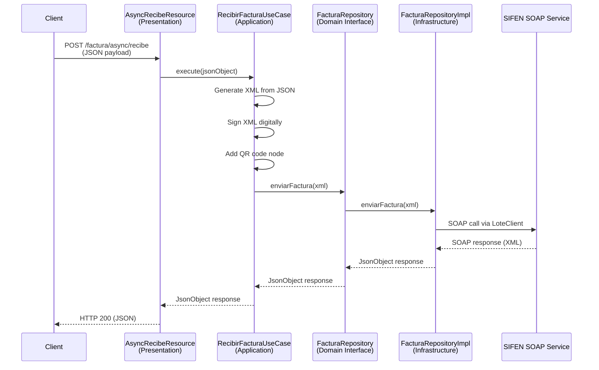

JSIFEN follows **Clean Architecture** principles, organizing code into four distinct layers with clear boundaries and dependencies flowing inward toward the domain.

## The Four Layers

<Accordion title="Domain Layer (Core Business Logic)">
  The innermost layer contains pure business logic with no external dependencies.

  **Location:** `src/main/java/com/jsifen/domain/`

  **Components:**
  - **Models:** Pure business entities like `FacturaElectronica`
  - **Repository Interfaces:** Contracts defining data operations (e.g., `FacturaRepository`, `RucRepository`)
  - **Domain Services:** Business logic utilities (e.g., `SifenDvCalculator`)

  **Key Classes:**
  - `domain/model/factura/FacturaElectronica.java` - Electronic invoice domain model
  - `domain/repository/FacturaRepository.java` - Invoice repository contract
  - `domain/repository/DERepository.java` - Electronic document repository contract
  - `domain/repository/RucRepository.java` - RUC query repository contract
  - `domain/service/SifenDvCalculator.java` - Verification digit calculator

  **Characteristics:**
  - No dependencies on frameworks or external libraries
  - Contains only business rules and entities
  - Defines interfaces (ports) for external implementations
</Accordion>

<Accordion title="Application Layer (Use Cases)">
  Orchestrates business workflows by coordinating domain objects and repository interactions.

  **Location:** `src/main/java/com/jsifen/application/usecase/`

  **Purpose:** Each use case represents a single business operation and coordinates the flow between layers.

  **Key Use Cases:**
  - `factura/RecibirFacturaUseCase.java` - Processes invoice submission
  - `factura/GenerarXmlFacturaUseCase.java` - Generates invoice XML
  - `de/ConsultarDEUseCase.java` - Queries electronic documents
  - `ruc/ConsultarRucUseCase.java` - Queries taxpayer RUC information
  - `lote/ConsultaLoteUseCase.java` - Queries batch status
  - `evento/CancelarEventoUseCase.java` - Cancels events
  - `info/SifenHealthUseCase.java` - Checks SIFEN service health

  **Characteristics:**
  - Depends only on domain layer
  - Contains application-specific business rules
  - No knowledge of HTTP, databases, or UI
</Accordion>

<Accordion title="Infrastructure Layer (Technical Implementation)">
  Provides concrete implementations of domain contracts and handles all external integrations.

  **Location:** `src/main/java/com/jsifen/infrastructure/`

  **Sub-packages:**

  **Adapters** (`infrastructure/adapter/`)
  - `FacturaRepositoryImpl.java` - Implements invoice repository
  - `DERepositoryImpl.java` - Implements DE repository
  - `RucRepositoryImpl.java` - Implements RUC repository
  - `LoteRepositoryImpl.java` - Implements batch repository
  - `EventoCancelarRepositoryImpl.java` - Implements event cancellation repository

  **SOAP Integration** (`infrastructure/soap/`)
  - `soap/client/lote/LoteClient.java` - SOAP client for batch operations
  - `soap/client/de/DEClient.java` - SOAP client for DE queries
  - `soap/client/ruc/RucClient.java` - SOAP client for RUC queries
  - `soap/signer/SifenXmlSigner.java` - XML digital signature
  - `soap/processor/SifenResponseProcessor.java` - SOAP response processing

  **SIFEN XML** (`infrastructure/sifen/xml/`)
  - `xml/buiilder/SifenFacturaXmlGenerator.java` - XML generation for invoices
  - `xml/buiilder/QrNodeBuilder.java` - QR code node builder
  - `xml/gen/CdcGenerator.java` - CDC (control code) generator

  **Configuration** (`infrastructure/config/`)
  - `config/sifen/SifenProperties.java` - SIFEN credentials and settings
  - `config/security/SSLConfig.java` - SSL/TLS configuration
  - `config/context/EmisorContext.java` - Issuer context management

  **Utilities** (`infrastructure/util/`)
  - `util/xml/XmlUtils.java` - XML manipulation utilities
  - `util/time/ClienteNTP.java` - NTP time synchronization

  **Characteristics:**
  - Implements domain repository interfaces
  - Handles external communication (SOAP, HTTP)
  - Manages technical concerns (XML, encryption, configuration)
</Accordion>

<Accordion title="Presentation Layer (API Controllers)">
  Exposes REST endpoints and handles HTTP request/response mapping.

  **Location:** `src/main/java/com/jsifen/presentation/rest/`

  **REST Resources:**
  - `factura/AsyncRecibeResource.java` - POST `/factura/async/recibe`
  - `factura/FacturaXmlGenerarResource.java` - Invoice XML generation endpoint
  - `consulta/de/ConsultaDEResource.java` - DE query endpoint
  - `consulta/ruc/ConsultaRucResource.java` - RUC query endpoint
  - `consulta/lote/ConsultaLoteResource.java` - Batch query endpoint
  - `evento/cancelar/EventoCancelarResource.java` - Event cancellation endpoint
  - `info/SifenHealthResource.java` - Health check endpoint

  **DTOs** (Data Transfer Objects)
  - `consulta/ruc/dto/request/ConsultaRucRequest.java`
  - `consulta/ruc/dto/response/ConsultarRucResponse.java`
  - `evento/cancelar/dto/CancelarRequest.java`
  - `evento/cancelar/dto/CancelarResponse.java`

  **Characteristics:**
  - Depends only on application layer
  - Handles HTTP concerns (routing, serialization)
  - Maps between DTOs and domain models
</Accordion>

## Data Flow Example: Receiving an Invoice

Let's trace how JSIFEN processes an invoice submission through all four layers:



### Step-by-Step Flow

**1. Presentation Layer** (`AsyncRecibeResource`)
```java
// presentation/rest/factura/AsyncRecibeResource.java:161
JsonObject jsonResponse = recibirFacturaUseCase.execute(jsonObject);
```
Receives HTTP POST request with invoice JSON and delegates to the use case.

**2. Application Layer** (`RecibirFacturaUseCase`)
```java
// application/usecase/factura/RecibirFacturaUseCase.java:29-51
public JsonObject execute(JsonObject facturaInput) throws Exception {
    // 1. Convert JSON to XML
    String xmlGenerado = xmlGenerator.generar(facturaInput);
    
    // 2. Sign XML
    Node nodoFirmado = xmlSigner.signXml(xmlGenerado);
    
    // 3. Add QR code
    Node nodoConQR = qrNodeBuilder.addQrNode(nodoFirmado);
    
    // 4. Convert to String
    String xmlFinal = FileXML.xmlToString(nodoConQR);
    
    // 5. Send via repository
    JsonObject respuestaJson = facturaRepository.enviarFactura(xmlFinal);
    
    return respuestaJson;
}
```
Orchestrates the complete workflow: XML generation, signing, QR addition, and submission.

**3. Domain Layer** (`FacturaRepository` interface)
```java
// domain/repository/FacturaRepository.java:5-6
public interface FacturaRepository {
    JsonObject enviarFactura(String xml);
}
```
Defines the contract without knowing implementation details.

**4. Infrastructure Layer** (`FacturaRepositoryImpl`)
```java
// infrastructure/adapter/FacturaRepositoryImpl.java:24-35
@Override
public JsonObject enviarFactura(String xml) {
    HttpResponse<String> httpResponse = loteClient.recibeLote(xml);
    
    int statusCode = httpResponse.statusCode();
    String xmlOutput = httpResponse.body();
    
    JSONObject json = XML.toJSONObject(xmlOutput);
    JsonObject jakartaJson = Json.createReader(
            new StringReader(json.toString())).readObject();
    
    return jakartaJson;
}
```
Implements the repository by calling the SOAP client and converting the XML response to JSON.

## Benefits of This Architecture

### 1. Testability
- **Domain logic** can be tested without frameworks
- **Use cases** can be tested with mock repositories
- **Infrastructure** can be tested independently

### 2. Maintainability
- Clear separation of concerns
- Changes to external APIs only affect infrastructure layer
- Business rules isolated in domain layer

### 3. Flexibility
- Easy to swap SOAP for REST without touching business logic
- Domain and application layers remain stable
- Can add new presentation layers (CLI, gRPC) without duplicating logic

### 4. Independence from Frameworks
- Core business logic (domain) doesn't depend on Quarkus
- Can migrate to different frameworks with minimal changes
- Business rules survive technology changes

## Dependency Rule

Dependencies always point inward:

```
Presentation → Application → Domain ← Infrastructure
```

- **Presentation** depends on **Application**
- **Application** depends on **Domain**
- **Infrastructure** depends on **Domain** (implements its interfaces)
- **Domain** depends on nothing

This ensures the business logic remains pure and framework-independent.